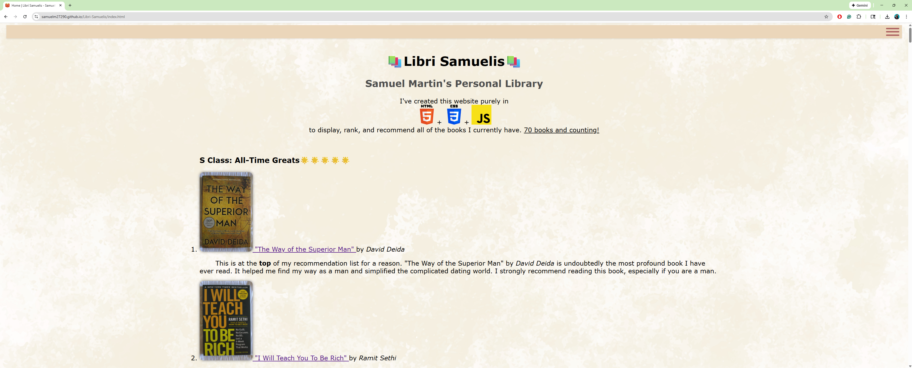

# Samuel Martin's Book Recommendations Website

## Fully functional website created in HTML, CSS, and JavaScript to showcase and recommend all of the books that are in my current possession.

This project was initiated to test the knowledge I gained from the book "HTML & CSS: Design and Build Websites" by Jon Duckett. Using basic instructions from his book, I created the HTML code with Visual Studio Code and developed the website as a result.

## What you will find in this repository

<ul>
  <li>5 HTML Files</li>
  <li>1 CSS File</li>
  <li>1 JavaScript File</li>
  <li>7 Sorting Folders Containing Images of Books Ranked By How Strongly I Would Recommend</li>
  <li>1 Folder Containing Other Web Icons</li>
  <li>License Page</li>
  <li>Other Miscellaneous Images</li>
</ul>

The main homepage of this website is titled "index.html". That is the actual HTML code for the main page.

## About the Website Itself

It contains 70 books ranked by how strongly I would personally recommend them to another person. Out of the 70 books listed, 65 of them contain affiliate links to Amazon for further purchase. In case a person was curious and wanted to get their hands on a book, those links are there to serve them. Plus, I would get a commission based on that purchase.

Knowing that there would be a lot of books, I created a side navigation bar so that a person can quickly jump from one section to the next without having to scroll all the way themselves. Additionally, I created a "Scroll to Top" arrow button, allowing users to return to the top of the page with a single click. However, this button will only appear once a person has scrolled a significant amount. All of these UX features were created through <strong>JavaScript</strong>.

It also includes a privacy policy page and a contact form, both of which are located in the footer.

## What I've Learned

<ul>
  <li>Coding websites using HTML, CSS, and JavaScript, utilizing tools like Visual Studio Code.</li>
  <li>Optimizing and cleaning up my HTML code.</li>
  <li>Figuring out what colors, styles, and fonts would look best for my website.</li>
  <li>The tedious process of uploading and publishing my code on GitHub, making it accessible to the world. </li>
</ul>

# Improvements for the Future

I want to add more language translations for people who only know a different language. A button that allows users to toggle between dark and light modes. A search bar for specific books on the web page. And more.

# Contact

If you want to express your opinions on the website, report bugs, or make suggestions, feel free to contact me:
<a href="mailto:samuelmartin7000@gmail.com">samuelmartin7000@gmail.com</a>
